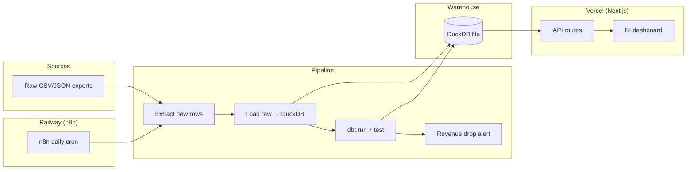

# E-commerce Analytics Pipeline

End-to-end analytics stack: simulated e-commerce exports → **n8n** scheduler → Python ETL → **DuckDB** warehouse → **dbt** transforms → **Next.js** BI dashboard.

## Architecture



### Data layers

| Layer | Location | Purpose |
|-------|----------|---------|
| Raw | `data/raw/*.csv` | Simulated platform API exports |
| Staging | `main_staging.*` | Typed, deduplicated source data |
| Intermediate | `main_intermediate.*` | Joined order line items |
| Marts | `main_marts.*` | Analytics-ready KPI tables |

### Mart models

- `mart_daily_revenue` — daily revenue, orders, AOV, new customers
- `mart_product_performance` — product revenue, units, return rate
- `mart_customer_cohorts` — cohort retention by month
- `mart_geo_revenue` — revenue by country

## Requirements

- **Python 3.11–3.12** recommended for native `dbt` CLI support
- **Node.js 18+** for the dashboard
- On Python 3.13+, the pipeline automatically falls back to equivalent DuckDB SQL transforms

## Quick start (3 commands)

```bash
# 1. Generate fake data + install Python deps
pip install -r requirements.txt && python seed.py

# 2. Run the full pipeline (load DuckDB + dbt transform + alert check)
python pipeline/run_pipeline.py

# 3. Start the dashboard
cd dashboard && npm install && npm run dev
```

Open [http://localhost:3000](http://localhost:3000).

## Project structure

```
├── seed.py                 # Generates 10k orders, 500 products, 2k customers
├── pipeline/
│   └── run_pipeline.py     # ETL with 3-attempt retry + revenue alerts
├── dbt/                    # dbt Core project (DuckDB adapter)
├── data/
│   ├── raw/                # Source CSV/JSON files
│   └── warehouse.duckdb    # Analytics warehouse (generated)
├── n8n/
│   └── workflow.json       # Import into n8n on Railway
├── dashboard/              # Next.js 14 BI app
└── railway.toml            # Pipeline container config
```

## Pipeline details

The daily pipeline (`pipeline/run_pipeline.py`):

1. **Extract** — reads CSV exports; simulates incremental loads via `pipeline_state.json`
2. **Load** — writes `raw.orders`, `raw.products`, `raw.customers` into DuckDB
3. **Transform** — runs `dbt run` and `dbt test` (staging → intermediate → marts)
4. **Alert** — logs a warning if daily revenue drops **>30%** vs the previous day (`data/logs/alerts.log`)

Each step retries up to **3 times** with a 5-second delay.

### Run dbt manually

```bash
cd dbt
dbt run --profiles-dir . --project-dir .
dbt test --profiles-dir . --project-dir .
```

## Dashboard

| Page | Features |
|------|----------|
| Overview | Monthly revenue vs last month, orders today, AOV, range KPIs |
| Revenue | 90-day line chart with 7-day moving average; toggle revenue/orders/AOV |
| Products | Sortable product table, top categories bar chart, return rates |
| Customers | Cohort retention heatmap, new vs returning trend |
| Geography | Europe choropleth (`react-simple-maps`), country drill-down |

All pages share a **date range picker** that filters API queries.

### Refresh dashboard data

The deployed dashboard reads **static JSON** from `dashboard/public/data/` (not DuckDB at runtime). After running the pipeline locally, export fresh data before deploying:

```bash
cd dashboard
npm run sync:warehouse   # copies ../data/warehouse.duckdb -> dashboard/data/
npm run export:data      # writes public/data/*.json
```

Commit the updated JSON files in `dashboard/public/data/` when you want Vercel to show new numbers.

## Production deployment

### Dashboard → Vercel

The dashboard API routes read pre-exported JSON from `public/data/` so they work on Vercel serverless without DuckDB.

1. **Generate the warehouse locally** (repo root):
   ```bash
   pip install -r requirements.txt && python seed.py && python pipeline/run_pipeline.py
   ```
2. **Export static JSON for the dashboard:**
   ```bash
   cd dashboard
   npm install
   npm run sync:warehouse
   npm run export:data
   ```
3. **Commit** `dashboard/public/data/*.json` (these files power production).
4. In Vercel project settings, set **Root Directory** to `dashboard`.
5. Deploy:
   ```bash
   cd dashboard && vercel --prod
   ```

> **Note:** Run `npm run export:data` locally whenever you refresh pipeline data, then commit and redeploy.

### Scheduler → Railway

1. Deploy the repo using `Dockerfile.pipeline` (see `railway.toml`).
2. Run `python seed.py` once (included in Docker build) or mount persistent storage for `data/`.
3. Import `n8n/workflow.json` into an n8n instance on Railway for daily runs at midnight UTC.

Alternative: use Railway cron to run `python pipeline/run_pipeline.py` directly without n8n.

## Data simulation

`seed.py` generates:

- **10,000** order line items over the past **2 years**
- **500** products across **8** categories
- **2,000** customers across **20** European countries

Fields: `order_id`, `customer_id`, `product_id`, `quantity`, `unit_price`, `discount`, `status`, `created_at`, `shipped_at`, `country`.

## License

MIT
